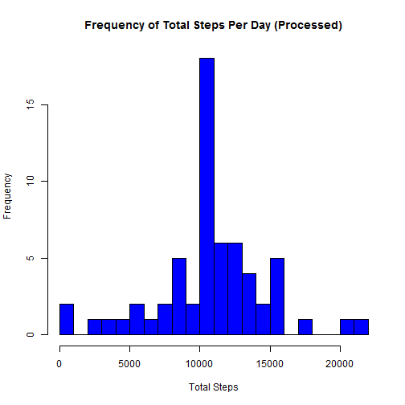

# Reproducible Research Course Project 1
Richard Casto  
1/13/2016

## Introduction
This assignment is meant to teach students how to use R Markdown to create an analysis project 
that conforms to the concepts of "Literate Statistical Programming".  The assignment provides 
a dataset from an activity monitoring device with 17,568 observations that tracks the 
number of steps taken within five minute intervals over two months in 2012.  The student 
is to then load the data, perform data manipulations via R, answer a number of 
questions, graph some data and provide documentation via markdown.

## Loading and preprocessing the data
The assignment provides the data file so there is no need to source it, but it provided 
as a compressed ZIP file.  The embedded CSV file is extracted from the ZIP file and then
loaded into a data frame.  This is the raw and un-processed activity data.

```r
activity.raw <- read.csv(unz("./activity.zip", "activity.csv"))
```

## What is mean total number of steps taken per day?
Let's answer some questions that center around the mean of the total number of steps take 
on a per day basis.

### Total steps per day
The step counts are tracked within five minute intervals.  To answer the question of the 
mean total number steps taken per day, you need to aggregate the step count by date (day) 
and then calculate the sum of those counts.

```r
sum.steps.per.day.raw <- aggregate(steps ~ date, data = activity.raw, FUN = sum, na.rm = TRUE)
```

### Histogram of total steps taken per day
Now that we have calculated that sum on a per day basis lets show a histogram of the total 
steps per day.  Note, the raw data has some time periods with NA values for the number 
of steps.  We are ignoring those values when using the raw data.

```r
with(sum.steps.per.day.raw, hist(steps, col = "blue", breaks = 20, main = "Frequency of Total Steps Per Day (Raw)", xlab = "Total Steps"))
```

 

### Mean of total steps per day
What is the mean of total steps per day?  Note, this is not a per day mean, but rather the 
mean of the "total steps per day".  This generates a single value.

```r
mean(sum.steps.per.day.raw$steps, na.rm = TRUE)
```

```
## [1] 10766.19
```

### Median of total steps per day
Similar to above, what is the median of the total steps per day?  Again, this is a single 
value.

```r
median(sum.steps.per.day.raw$steps, na.rm = TRUE)
```

```
## [1] 10765
```

## What is the average daily activity pattern?
Are there any patterns that happen on a daily basis?  This is similar to above, but 
instead of aggregating the step count by date (day), we will aggregate the step count by
interval and then calculate the average of those counts.

### Mean step per interview

```r
mean.steps.per.interval.raw <- aggregate(steps ~ interval, data = activity.raw, FUN = mean, na.rm = TRUE)
```
### Mean step per interview line plot
Now using a time series plot of the five minute interval on the x-axis, we show the average 
number of steps taken.  This uses the data frame calculated directly above.

```r
plot(mean.steps.per.interval.raw, type="l", col = "blue", main = "Mean Steps Per Interval (Raw Data)", xlab = "Interval", ylab = "Mean Steps")
```

 

### Interval that has the maximum number of steps?
Using the same data calculated above, we want to know which aggregated interval (across all days) has 
the most (maximum) number of steps?  The interval value is returned.

```r
mean.steps.per.interval.raw$interval[which.max(mean.steps.per.interval.raw$steps)]
```

```
## [1] 835
```

## Imputing missing values
As mentioned above, the raw data has NA values for some of the intervals.  The summary info below shows that the NA values are in the "steps" column.

```r
summary(activity.raw)
```

```
##      steps                date          interval     
##  Min.   :  0.00   2012-10-01:  288   Min.   :   0.0  
##  1st Qu.:  0.00   2012-10-02:  288   1st Qu.: 588.8  
##  Median :  0.00   2012-10-03:  288   Median :1177.5  
##  Mean   : 37.38   2012-10-04:  288   Mean   :1177.5  
##  3rd Qu.: 12.00   2012-10-05:  288   3rd Qu.:1766.2  
##  Max.   :806.00   2012-10-06:  288   Max.   :2355.0  
##  NA's   :2304     (Other)   :15840
```

### Number of missing values.
While the summary info above does show the number of missing values, we need to explicitly calculate 
and report the number of missing observations that have NA in the steps column and then sum of and 
report that value.

```r
sum(is.na(activity.raw$steps))
```

```
## [1] 2304
```

### Strategy to impute the NA values.
A strategy is needed to fill in all of the missing values in the raw data.  There are a few different 
ways that this could be done. For example you could calculate and use mean steps value on a per day or 
interval basis.  The strategy that was selected was to use the mean steps on a per interval basis.  And 
then for any interval (regardless of day/date) that has an NA value, substitute the mean value.

Note, that the source step values are whole numbers (integer type) while the mean will be a numeric.  To 
resolve this, the mean value is rounded to the closest whole number and converted to an integer.

```r
mean.steps.per.interval.processed <- mean.steps.per.interval.raw
mean.steps.per.interval.processed$steps = as.integer(round(mean.steps.per.interval.processed$step))
```

### Create a new dataset that is equal to the original dataset but with the missing data filled in.
For any observations that have a NA step value we use the interval for that observation to lookup in 
the dataset created above to get the value to substitute.  This new dataset is labeled as "processed".

```r
activity.processed <- activity.raw
activity.processed$steps[is.na(activity.processed$steps)] <- mean.steps.per.interval.processed$steps[match(activity.processed$interval[is.na(activity.processed$steps)],mean.steps.per.interval.processed$interval)]
```
### Total steps per day (Processed)
Similar to the raw data, we calculate the total steps per day using the processed data.

```r
sum.steps.per.day.processed <- aggregate(steps ~ date, data = activity.processed, FUN = sum, na.rm = TRUE)
```
### Histogram of total steps taken per day (Processed)
Similar to the raw data, we show a histogram of the total steps per day using the processed data.  Given 
the method of substitution the shape doesn't change much, but the frequency increases for any values that 
were used as substitutes.

```r
with(sum.steps.per.day.processed, hist(steps, col = "blue", breaks = 20, main = "Frequency of Total Steps Per Day (Processed)", xlab = "Total Steps"))
```

 

### Mean of total steps per day (Processed)
Similar to what was done with the raw data, we show the mean of the total steps per day using 
the processed data.

```r
mean(sum.steps.per.day.processed$steps)
```

```
## [1] 10765.64
```

### Median of total steps per day
Similar to what was done with the raw data, we show the median of the total steps per day using 
the processed data.

```r
median(sum.steps.per.day.processed$steps)
```

```
## [1] 10762
```

### What is the impact of imputing the missing data?
The impact is a slight reduction in the mean and median values.  This is because it looks like most 
of the NA values were for intervals that generally had low step counts and was below the mean and median
values from the raw data.  So the addition of the imputed data pulled the mean and median values down, 
but by small amounts because there were a significant number of intervals with much higher step counts.

## Are there differences in activity patterns between weekdays and weekends?
To evaluate the activity patterns between weekdays and weekends we first need to create a function that 
will accept a date value and return the value "weekend" or "weekday" based upon the day of the week for 
the given date.  This is done by converting the data into a weekday name value and then using IF THEN 
logic to categorize.

```r
daytype <- function(date) {
  if (weekdays(date) %in% c("Saturday", "Sunday")) {
    "weekend"
  } else {
    "weekday"
  }
}
```

Then using sapply, we process each observation using the "daytype" function from above and create a 
new daytype column in the processed dataset.  Lastly we convert that new column into a factor as 
instructed in the assignment.

```r
activity.processed$daytype <- sapply(as.Date(activity.processed$date), daytype)
activity.processed$daytype <- as.factor(activity.processed$daytype)
```

Next we calculate the mean steps per interval like above, but this time we subset on the daytype factor
values that we just created.  This creates a new dataset per daytype.

```r
mean.steps.per.interval.weekend <- aggregate(steps ~ interval, data = activity.processed, subset = activity.processed$daytype == "weekend", FUN = mean, na.rm = TRUE)

mean.steps.per.interval.weekday <- aggregate(steps ~ interval, data = activity.processed, subset = activity.processed$daytype == "weekday", FUN = mean, na.rm = TRUE)
```

Using similar time interval plots like above, we can see that there are much less activity on weekdays 
when compared to weekends.  This is particularly noticeable in the middle of the day.  Do the subjects 
have desk jobs during the weekday that cause them to be more sedentary?

```r
par(mfrow = c(1, 2))

plot(mean.steps.per.interval.weekend, type="l", col = "blue", main = "Weekend", xlab = "Interval", ylab = "Mean Steps")
plot(mean.steps.per.interval.weekday, type="l", col = "blue", main = "Weekday", xlab = "Interval", ylab = "Mean Steps")
```

 

